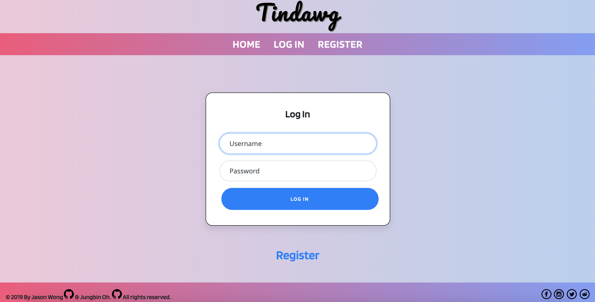
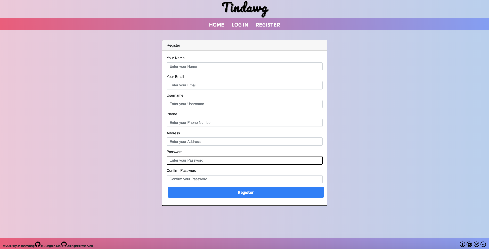
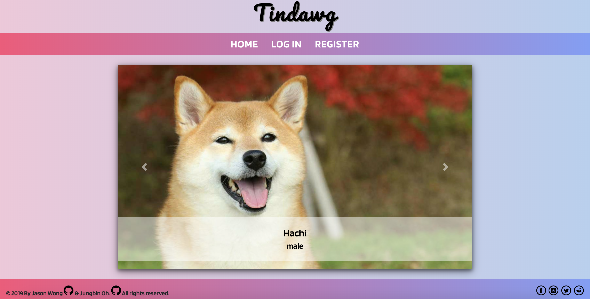
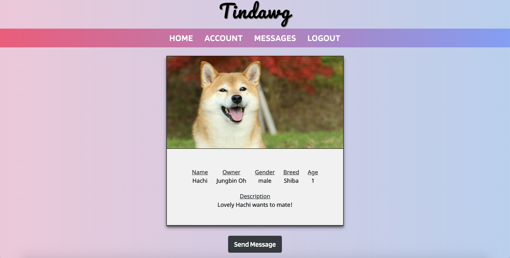
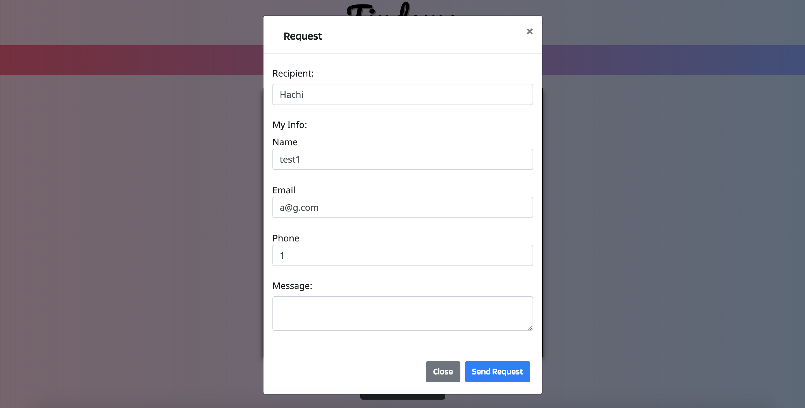
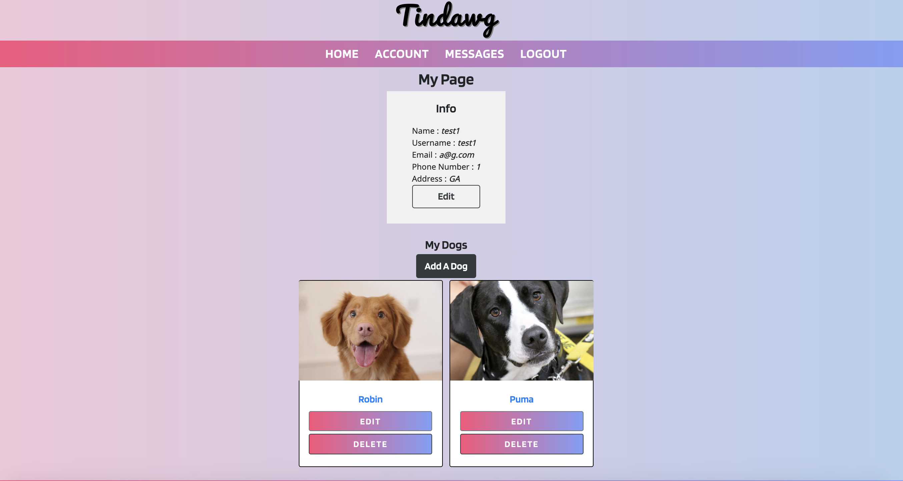
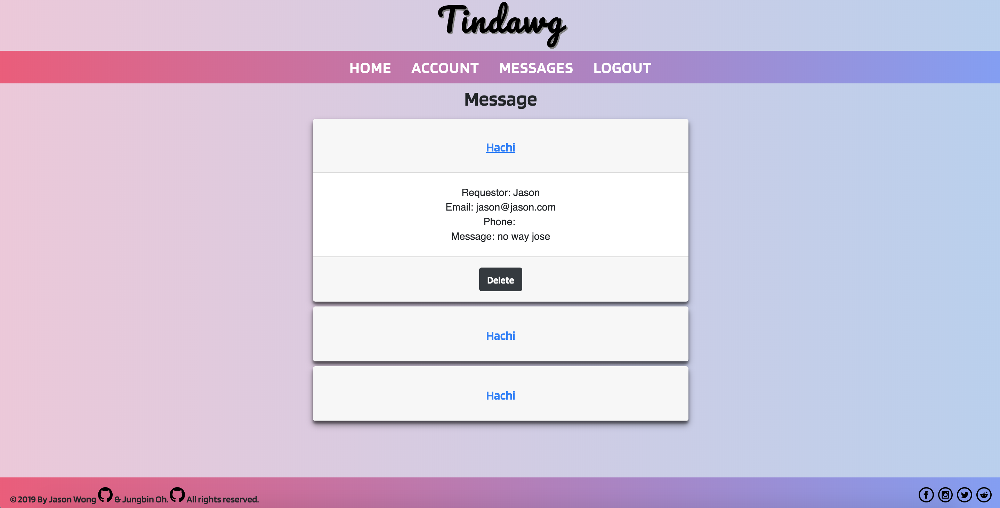

# Tindawg

## Intro

### Website URL

[Tindawg](https://tindawg.herokuapp.com/) 

### Motivation

This project is a full-stack development project of Jungbin Oh and Jason Wong. Tindawg is a website that helps dog owners to find a match for their dogs. Users can upload information about their dog on this page and receive requests from other dog owners. 

### Built With

- HTML5
- CSS3
- JavaScript
- MongoDB
- ExpressJS
- Bootstrap

## Wireframe

### Log In & Registration

Users can log in on the starting page.

The link from the starting page leads to the registration page.

### Home

The home page displays all the dogs that users have uploaded in carrousels.

### Dog Details

By clicking the image, the user can see details about the specific dog.

### Request

Users can send the meeting requests by clicking the "Send Message" button.

### Account

"Account" button on the nav bar leads to the account information page. 

The user can see and edit their personal info, add their dogs' profiles, and edit all of the above.

### Message

The user can access and view the messages/requests that they have received through the "Messages" button on the navbar.

